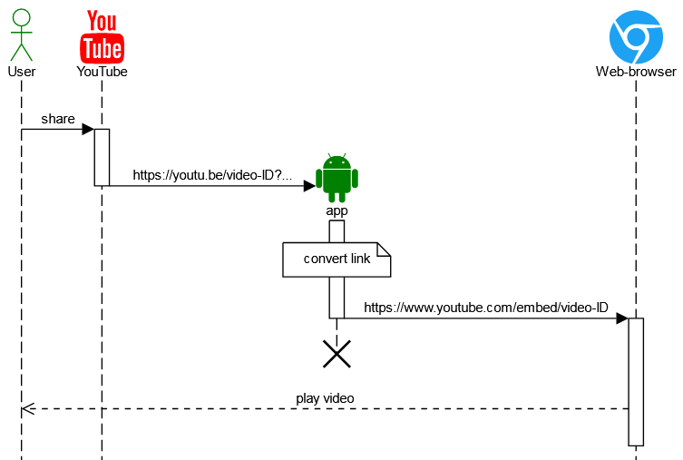
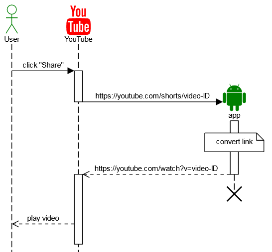

# YouTube Shared
Android app that converts YouTube video link into ads-free browser video link. 


🎧 Love listening to audiobooks on YouTube, but dealing with ads and the inability to play videos in the background without a premium subscription can be a challenge. 🤔

I noticed that these two drawbacks are absent in embedded YouTube videos found on external websites. By obtaining the video ID and using it in an embedded link template, you can turn any video link into an ad-free, background-playable version. This link can be opened directly in your browser, allowing for uninterrupted playback.

Initially, I manually performed these steps since I lacked Android app development skills. However, after learning a few things, I decided to automate the process of redirecting videos from the YouTube app to the browser. 🔄

## Disclaimer

> [!NOTE]
> This application is created with no malicious intent. It is not intended to harm or interfere with any actions of Google or advertisers on the YouTube platform. The application solely automates specific actions that a regular user could manually perform. The functionality of the application adheres to all laws and does not alter any standard functionalities of the Android platform or other applications. It merely utilizes the capabilities provided by the Android platform and other applications.

## Functionality requirements

Let's first determine the functions our application should have:

* No GUI - this app is just a 'proxy.'
* It should be able to receive shared text, including links from the YouTube app.
* Actions with the link:
  1. Extract ID.
  1. Create an 'embedded link' with the received ID.
  1. Open the 'embedded link' in the browser (avoid launching the YouTube app as the default app for YouTube links).
 

 
## Main Activity implementation

This is what an embedded link looks like:
```
https://www.youtube.com/embed/video-ID
```

YouTube may share the link of the video in two formats:
* `https://youtu.be/video-ID`
* `https://youtube.com/watch?v=video-ID&other=parameters`

To extract the video ID, we can use RegExp:
```
https?://youtu(\.be/|be\.com/watch\?v=)(?<videoId>[A-Za-z0-9_\-]+)
```
where "videoId" is a group name for symbols which should be extracted.

Then, concatenate `https://www.youtube.com/embed/` with the extracted video ID.

To create an intent to launch the browser instead of the YouTube app by default:
```
final Intent intent = 
  Intent.makeMainSelectorActivity(
    Intent.ACTION_MAIN, Intent.CATEGORY_APP_BROWSER)
  .setData(uri);
```

## Configuration of the Manifest.xml

To prevent our app from having duplicate instances:
```
<application
  android:launchMode="singleTask"
```

Ability to receive shared text:
```
<activity>
  <intent-filter>
    <action android:name="android.intent.action.SEND" />
    <category android:name="android.intent.category.DEFAULT" />
    <data android:mimeType="text/plain" />
  </intent-filter>
```

## Results

Let's check the log to be sure that our app works fine:
```
11:49:06.283 onCreate
11:49:06.283 receivedText = https://youtube.com/watch?v=video-ID&si=a_bCDEfj1-HIjK-m
11:49:06.283 videoId = video-ID
11:49:06.284 uri = https://www.youtube.com/embed/video-ID
11:49:06.313 processReceivedText(): finished
11:49:07.134 onDestroy()
```
Here, you can see the next sequence:
1. The app receives shared text with the link to the YouTube video.
1. The video ID is successfully extracted.
1. An embedded link for the browser is generated.
1. After sending the converted link to the browser, our app quickly finishes its execution.

When I finished implementing the 'share with the browser' functionality, I decided to expand the capabilities of my app a bit. There is another drawback on YouTube that my application can address – the absence of the "Open as Regular Video" button for "Shorts" in order to access the playback speed control feature.

There is a "Shorts" link format:
```
https://youtube.com/shorts/video-ID
```

So, we need just convert it to:
```
https://youtube.com/watch?v=video-ID
```
or:
```
vnd.youtube:video-ID
```

and open in a YouTube app:
```
final Intent intent = new Intent(Intent.ACTION_VIEW);
intent.setData(uri);
```

And since our application has completed its tasks, it is necessary to notify Android that it can be unloaded from memory by calling the `finish()` method.



## Special Cases

When I tested my app on my old smartphone with MIUI Android, I encountered an issue where the intended app wouldn't start. I discovered that it could not run when my app was shut down by calling `finish()`, but it started as designed without this call. I received the error message in the logs:
```
com.android.server.am.ExtraActivityManagerService
MIUILOG-
Permission Denied Activity :
Intent {
  sel=act=android.intent.action.MAIN
  cat=[android.intent.category.APP_BROWSER]}
....
```

After spending some time searching on the Internet, I found out that the problem is related to a specific MIUI security permission - `Start in background`, and the user should manually enable it for our app:


**Another case**

If the author of the video has disabled embedding, it won't be possible to watch such a video using the method described in this article. However, it's worth noting that such cases are extremely rare.

## Sources
* [AndroidManifest.xml](app/src/main/AndroidManifest.xml)
* [MainActivity.java](app/src/main/java/ua/in/asilichenko/youtubeshared/MainActivity.java)
* [WhenGetVideoIdTest.java](app/src/test/java/ua/in/asilichenko/youtubeshared/WhenGetVideoIdTest.java)
* [Sequence diagram: Web-browser](docs/uml/txt/sequence-diagram.txt)
* [Sequence diagram: Shorts](docs/uml/txt/shorts-sequence.txt)

## Authors
[Oleksii Sylichenko](https://github.com/asilichenko)

## References and Tools
* [UML Diagrams](docs/uml) were created by https://sequencediagram.org

## License
[MIT License](LICENSE)
